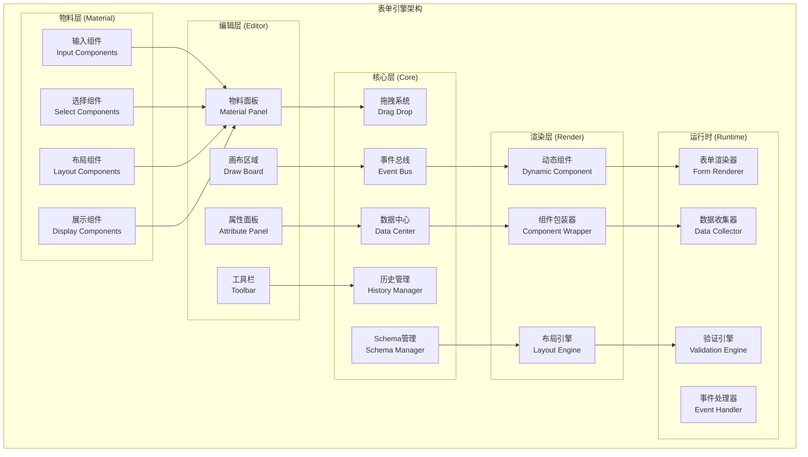
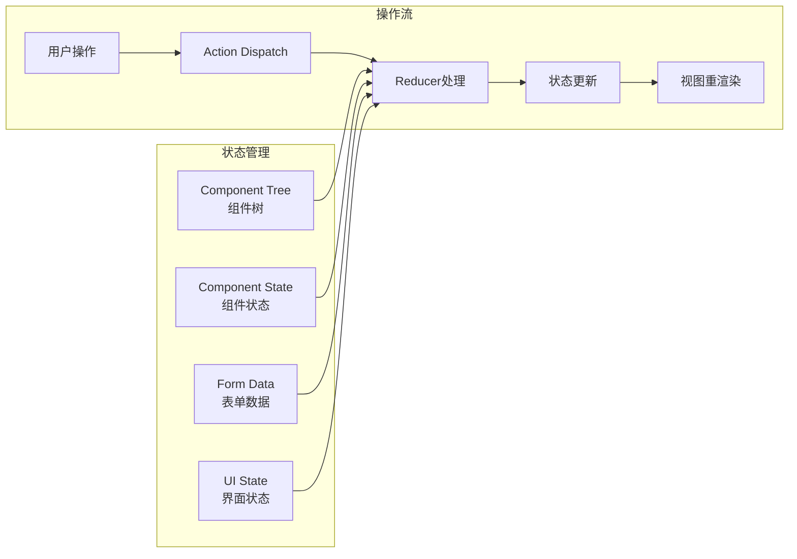

# 表单引擎增强设计文档

## 概述

表单引擎增强项目旨在将现有的基础表单构建器发展为功能完整的低代码表单平台。系统采用编辑器-运行时分离的架构，支持可视化表单设计、动态组件渲染、完整的表单运行时功能。

核心目标：
- 完善基础编辑功能（删除、复制、移动、撤销重做）
- 实现完整的属性编辑系统
- 构建功能完整的表单运行时
- 实现核心系统模块（事件系统、数据管理、Schema管理）
- 扩展物料组件库
- 实现高级功能特性（主题、国际化、API集成）
- 优化性能和用户体验
- 完善开发者体验

## 架构

### 整体架构



### 数据流架构



## 组件和接口

### 核心组件接口

#### 1. 事件总线 (EventBus)

```typescript
interface EventBus {
  // 订阅事件
  on<T>(event: string, callback: (data: T) => void): () => void;
  
  // 发布事件
  emit<T>(event: string, data: T): void;
  
  // 一次性订阅
  once<T>(event: string, callback: (data: T) => void): void;
  
  // 取消订阅
  off(event: string, callback?: Function): void;
  
  // 清空所有订阅
  clear(): void;
}
```

#### 2. 数据中心 (DataCenter)

```typescript
interface DataCenter {
  // 获取数据
  get<T>(key: string): T | undefined;
  
  // 设置数据
  set<T>(key: string, value: T): void;
  
  // 删除数据
  delete(key: string): boolean;
  
  // 批量操作
  batch(operations: Array<{type: 'set' | 'delete', key: string, value?: any}>): void;
  
  // 订阅数据变化
  subscribe(key: string, callback: (value: any) => void): () => void;
}
```

#### 3. Schema管理器 (SchemaManager)

```typescript
interface FormSchema {
  version: string;
  components: ComponentNode[];
  layout: LayoutConfig;
  events: EventConfig[];
  validation: ValidationConfig;
  theme: ThemeConfig;
}

interface SchemaManager {
  // 导出Schema
  export(): FormSchema;
  
  // 导入Schema
  import(schema: FormSchema): void;
  
  // 验证Schema
  validate(schema: FormSchema): ValidationResult;
  
  // 版本迁移
  migrate(schema: FormSchema, targetVersion: string): FormSchema;
}
```

#### 4. 历史管理器 (HistoryManager)

```typescript
interface HistoryManager {
  // 执行命令
  execute(command: Command): void;
  
  // 撤销
  undo(): boolean;
  
  // 重做
  redo(): boolean;
  
  // 清空历史
  clear(): void;
  
  // 获取历史状态
  getHistory(): HistoryState;
}

interface Command {
  execute(): void;
  undo(): void;
  description: string;
}
```

### 组件状态接口

#### 1. 组件树节点

```typescript
interface ComponentNode {
  id: string;
  parentId: string | null;
  componentName: string;
  children: string[];
  order: number;
}
```

#### 2. 组件状态

```typescript
interface ComponentState {
  componentId: string;
  componentName: string;
  props: Record<string, any>;
  style: CSSProperties;
  events: EventBinding[];
  validation: ValidationRule[];
  active: boolean;
  locked: boolean;
  visible: boolean;
}
```

#### 3. 物料定义

```typescript
interface MaterialDefinition {
  componentName: string;
  category: MaterialCategory;
  name: string;
  icon: string;
  description: string;
  configSchema: ConfigSchema;
  defaultProps: Record<string, any>;
  defaultStyle: CSSProperties;
}
```

## 数据模型

### 1. 表单配置数据模型

```typescript
interface FormConfig {
  // 基本信息
  id: string;
  name: string;
  description: string;
  version: string;
  createdAt: Date;
  updatedAt: Date;
  
  // 组件配置
  components: ComponentNode[];
  componentStates: Record<string, ComponentState>;
  
  // 布局配置
  layout: {
    width: number;
    height: number;
    background: string;
    padding: number;
  };
  
  // 表单配置
  form: {
    method: 'GET' | 'POST';
    action: string;
    validation: ValidationConfig;
    submission: SubmissionConfig;
  };
  
  // 主题配置
  theme: ThemeConfig;
}
```

### 2. 运行时数据模型

```typescript
interface RuntimeData {
  // 表单数据
  formData: Record<string, any>;
  
  // 验证结果
  validationResults: Record<string, ValidationResult>;
  
  // 字段状态
  fieldStates: Record<string, FieldState>;
  
  // 提交状态
  submissionState: {
    loading: boolean;
    error: string | null;
    success: boolean;
  };
}

interface FieldState {
  value: any;
  error: string | null;
  touched: boolean;
  dirty: boolean;
  disabled: boolean;
  visible: boolean;
}
```

### 3. 事件数据模型

```typescript
interface EventBinding {
  eventType: string;
  handler: EventHandler;
  conditions?: EventCondition[];
}

interface EventHandler {
  type: 'action' | 'script' | 'api';
  config: any;
}

interface EventCondition {
  field: string;
  operator: 'eq' | 'ne' | 'gt' | 'lt' | 'in' | 'contains';
  value: any;
}
```

## 正确性属性

*属性是一个特征或行为，应该在系统的所有有效执行中保持为真——本质上是关于系统应该做什么的正式声明。属性作为人类可读规范和机器可验证正确性保证之间的桥梁。*

### 属性反思

在分析所有可测试的验收标准后，我识别出以下需要合并或优化的冗余属性：

**冗余分析：**
- 属性1.1-1.6都是编辑操作的不同方面，但每个都提供独特的验证价值，保持独立
- 属性2.1-2.6都是属性编辑的不同方面，每个验证不同的配置功能，保持独立  
- 属性3.1-3.6都是运行时的不同方面，每个验证不同的运行时功能，保持独立
- 属性5.1-5.6都是物料展示的验证，可以合并为一个综合属性
- 属性8.1、8.2、8.3、8.5是开发体验的静态验证，可以合并

**合并后的属性：**

### 编辑功能属性

**Property 1: 组件删除一致性**
*对于任何* 表单中的组件，当执行删除操作时，该组件应该从组件树中移除且不再在画布上显示
**Validates: Requirements 1.1**

**Property 2: 组件复制粘贴往返**
*对于任何* 表单组件，复制后粘贴应该创建一个具有相同属性但不同ID的新组件
**Validates: Requirements 1.2, 1.3**

**Property 3: 组件拖拽位置更新**
*对于任何* 画布上的组件，拖拽移动后组件的位置状态应该反映新的坐标
**Validates: Requirements 1.4**

**Property 4: 组件大小调整一致性**
*对于任何* 支持大小调整的组件，调整大小后组件的样式应该反映新的尺寸
**Validates: Requirements 1.5**

**Property 5: 编辑操作历史往返**
*对于任何* 编辑操作序列，执行撤销后重做应该恢复到撤销前的状态
**Validates: Requirements 1.6**

### 属性编辑属性

**Property 6: 属性面板显示完整性**
*对于任何* 选中的组件，属性面板应该显示该组件类型的所有可配置属性
**Validates: Requirements 2.1**

**Property 7: 属性修改实时更新**
*对于任何* 组件属性的修改，组件状态和预览效果应该立即反映变更
**Validates: Requirements 2.2**

**Property 8: 样式属性应用正确性**
*对于任何* 样式属性的配置，组件的渲染样式应该与配置值一致
**Validates: Requirements 2.3**

**Property 9: 事件绑定功能性**
*对于任何* 配置的事件绑定，触发对应事件时应该执行绑定的处理逻辑
**Validates: Requirements 2.4**

**Property 10: 验证规则有效性**
*对于任何* 配置的验证规则，在表单验证时应该按照规则进行校验
**Validates: Requirements 2.5**

**Property 11: 数据绑定一致性**
*对于任何* 配置的数据绑定，组件的值应该与绑定的数据字段保持同步
**Validates: Requirements 2.6**

### 运行时功能属性

**Property 12: Schema渲染完整性**
*对于任何* 有效的表单Schema，运行时应该正确渲染所有定义的组件
**Validates: Requirements 3.1**

**Property 13: 表单数据收集准确性**
*对于任何* 用户在表单中的输入，数据收集器应该准确记录所有字段的值
**Validates: Requirements 3.2**

**Property 14: 表单验证执行正确性**
*对于任何* 表单提交，验证引擎应该执行所有配置的验证规则并返回正确结果
**Validates: Requirements 3.3**

**Property 15: 验证通过提交处理**
*对于任何* 通过验证的表单，应该触发提交事件并传递完整的表单数据
**Validates: Requirements 3.4**

**Property 16: 验证失败阻止提交**
*对于任何* 验证失败的表单，应该显示错误信息并阻止提交操作
**Validates: Requirements 3.5**

**Property 17: 字段联动响应性**
*对于任何* 配置了联动规则的字段，当触发条件满足时应该正确执行联动行为
**Validates: Requirements 3.6**

### 核心系统属性

**Property 18: 事件总线通信可靠性**
*对于任何* 事件的发布，所有订阅该事件的监听器都应该收到事件数据
**Validates: Requirements 4.1, 4.2**

**Property 19: 数据中心CRUD一致性**
*对于任何* 数据操作，数据中心应该正确执行增删改查并保持数据一致性
**Validates: Requirements 4.3**

**Property 20: Schema序列化往返**
*对于任何* 有效的表单Schema，导出后导入应该得到等价的Schema对象
**Validates: Requirements 4.4**

**Property 21: 拖拽辅助功能性**
*对于任何* 拖拽操作，应该显示辅助线和吸附提示以改善用户体验
**Validates: Requirements 4.5**

**Property 22: 错误处理完整性**
*对于任何* 系统错误，错误边界应该捕获错误并提供友好的错误信息
**Validates: Requirements 4.6**

### 高级功能属性

**Property 23: 主题切换一致性**
*对于任何* 主题切换操作，所有界面元素应该立即应用新主题的样式
**Validates: Requirements 6.1**

**Property 24: 国际化切换完整性**
*对于任何* 语言切换操作，所有界面文本应该立即更新为目标语言
**Validates: Requirements 6.2**

**Property 25: API数据绑定同步性**
*对于任何* 配置的API数据源，数据变化时绑定的组件应该同步更新
**Validates: Requirements 6.3**

**Property 26: 插件系统扩展性**
*对于任何* 加载的插件，插件功能应该正确集成到系统中并可正常使用
**Validates: Requirements 6.4**

**Property 27: 版本管理一致性**
*对于任何* 版本保存操作，历史记录应该正确维护并支持版本回滚
**Validates: Requirements 6.5**

**Property 28: 协作编辑同步性**
*对于任何* 多用户协作场景，用户操作应该正确同步到其他协作者
**Validates: Requirements 6.6**

### 性能优化属性

**Property 29: 虚拟滚动性能优化**
*对于任何* 包含大量组件的表单，虚拟滚动应该保持流畅的渲染性能
**Validates: Requirements 7.1**

**Property 30: 操作响应时间保证**
*对于任何* 用户操作，系统响应时间应该在100毫秒以内
**Validates: Requirements 7.2**

**Property 31: 渲染优化精确性**
*对于任何* 组件状态更新，只有受影响的组件应该重新渲染
**Validates: Requirements 7.3**

**Property 32: 拖拽体验流畅性**
*对于任何* 拖拽操作，应该提供实时预览和流畅的视觉反馈
**Validates: Requirements 7.4**

**Property 33: 加载优化有效性**
*对于任何* 系统加载，代码分割和懒加载应该显著提升加载速度
**Validates: Requirements 7.5**

**Property 34: 复杂操作用户体验**
*对于任何* 耗时操作，应该提供清晰的加载状态和进度提示
**Validates: Requirements 7.6**

### 开发体验属性

**Property 35: 错误信息详细性**
*对于任何* 系统错误，应该提供详细的错误信息和调试上下文
**Validates: Requirements 8.4**

## 错误处理

### 错误分类和处理策略

#### 1. 用户操作错误
- **拖拽失败**: 显示错误提示，恢复组件到原位置
- **属性配置错误**: 实时验证，显示错误信息，阻止无效配置
- **表单验证错误**: 显示字段级错误信息，高亮错误字段

#### 2. 系统运行错误
- **组件渲染错误**: 使用错误边界捕获，显示错误占位符
- **数据加载错误**: 显示重试按钮，记录错误日志
- **API调用错误**: 显示网络错误提示，支持重试机制

#### 3. 数据一致性错误
- **状态同步错误**: 自动重新同步，记录冲突日志
- **Schema验证错误**: 显示详细验证报告，提供修复建议
- **版本冲突错误**: 提供合并选项，支持手动解决冲突

### 错误恢复机制

```typescript
interface ErrorRecovery {
  // 自动恢复
  autoRecover(error: SystemError): boolean;
  
  // 用户引导恢复
  guideUserRecover(error: UserError): RecoveryAction[];
  
  // 数据备份恢复
  recoverFromBackup(timestamp: Date): boolean;
  
  // 重置到安全状态
  resetToSafeState(): void;
}
```

## 测试策略

### 双重测试方法

我们将采用**单元测试**和**基于属性的测试**相结合的方法：

- **单元测试**: 验证具体示例、边界情况和错误条件
- **基于属性的测试**: 验证所有输入的通用属性
- 两者互补，提供全面覆盖（单元测试捕获具体错误，属性测试验证通用正确性）

### 基于属性的测试配置

**测试库选择**: 使用 `fast-check` 进行基于属性的测试
**测试配置**: 每个属性测试最少运行100次迭代（由于随机化）
**测试标记**: 每个属性测试必须引用其设计文档属性

标记格式: **Feature: form-engine-enhancement, Property {number}: {property_text}**

### 测试覆盖策略

#### 1. 编辑功能测试
- **单元测试**: 测试特定的删除、复制、粘贴场景
- **属性测试**: 验证编辑操作的通用正确性
- **集成测试**: 测试编辑操作的组合使用

#### 2. 运行时功能测试
- **单元测试**: 测试特定的验证规则和提交场景
- **属性测试**: 验证表单处理的通用属性
- **端到端测试**: 测试完整的表单生命周期

#### 3. 性能测试
- **负载测试**: 测试大量组件的性能表现
- **响应时间测试**: 验证操作响应时间要求
- **内存使用测试**: 监控内存泄漏和使用优化

### 测试数据生成策略

#### 1. 智能生成器设计
```typescript
// 组件生成器
const componentGenerator = fc.record({
  id: fc.uuid(),
  componentName: fc.constantFrom('fe-input', 'fe-select', 'fe-textarea'),
  props: fc.dictionary(fc.string(), fc.anything()),
  style: fc.record({
    position: fc.constant('absolute'),
    top: fc.integer(0, 1000),
    left: fc.integer(0, 1000),
    width: fc.integer(100, 500),
    height: fc.integer(30, 200)
  })
});

// Schema生成器
const schemaGenerator = fc.record({
  version: fc.constant('1.0'),
  components: fc.array(componentGenerator, 1, 50),
  layout: fc.record({
    width: fc.integer(800, 1920),
    height: fc.integer(600, 1080)
  })
});
```

#### 2. 约束条件处理
- **有效性约束**: 生成器确保生成的数据符合业务规则
- **边界条件**: 特别测试最小值、最大值、空值等边界情况
- **依赖关系**: 确保生成的数据满足组件间的依赖关系